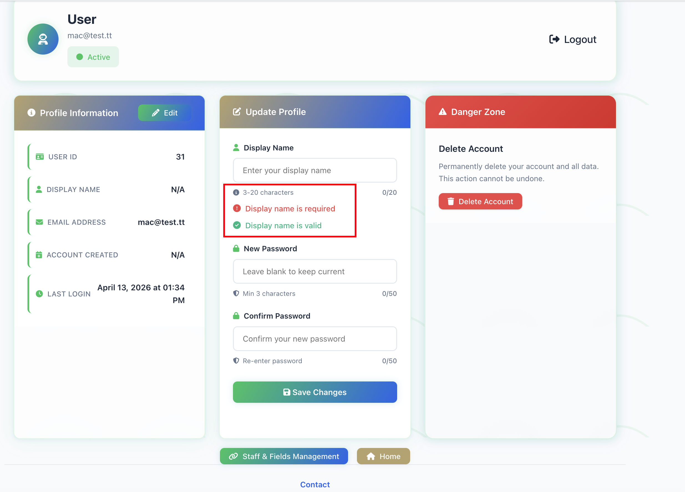
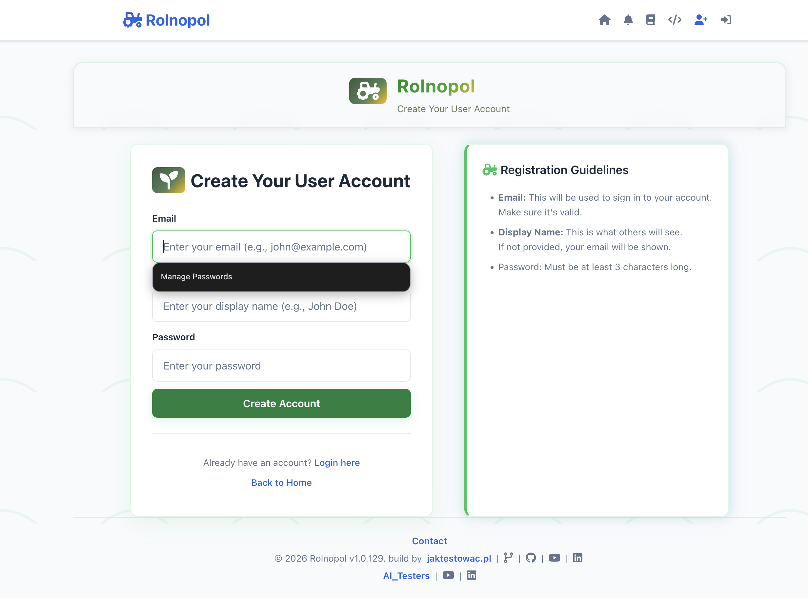

List of issues found in [Rolnopol](https://github.com/jaktestowac/rolnopol) app while working on the specs:
- 3 high severity vulnerabilities in installed npm packages
priority: high
explanation: we cannot have on production app that has critical security vulnerabilities!

- Safari browser, user is not able to authenticate: 

priority: high
explanation: safari users are completely blocked from using our app

- validation and success message shown in the same time while saving profile name:

priority: medium
explanation: it is not blocking the user but it is misleading, users will easily find the issue so many users will be impacted

- no validation on registration form is visible on Firefox if user has some password saved:

priority: low
explanation: the manage passwords overlap the validation visible on Chrome and Safari. It affects only Firefox users. But still validations are important for end users and should be visible to indicate what user need to adjust.